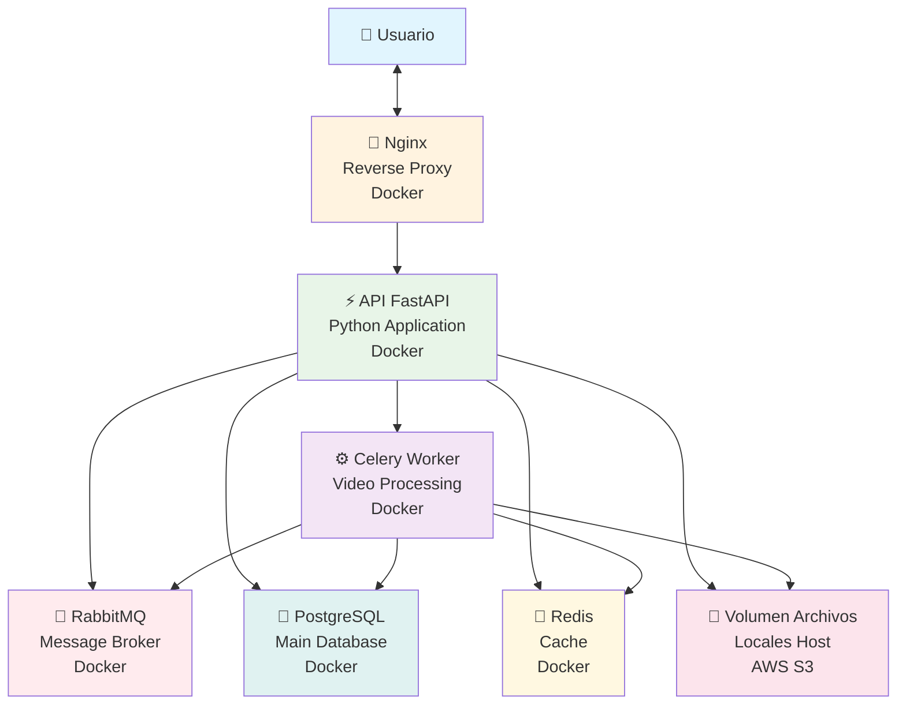

# Arquitectura de Software - ANB Rising Stars Showcase

## 1. Recolección de Requisitos

**Funcionales:**
- Gestión de usuarios: registro, autenticación, perfiles.
- Carga de videos por jugadores.
- Procesamiento asíncrono de videos: recorte, ajuste de resolución/aspecto, marca de agua, eliminación de audio, cortinilla.
- Votación pública y ranking de jugadores.
- Consulta y descarga de videos procesados.
- Eliminación de videos bajo condiciones.
- Gestión del ciclo de vida de los archivos.
- Exposición de endpoints REST documentados con OpenAPI.

**No funcionales:**
- Escalabilidad (procesamiento y concurrencia).
- Seguridad (autenticación, autorización, gestión de contraseñas, JWT).
- Disponibilidad y resiliencia.
- Portabilidad (contenedores Docker).
- Facilidad de despliegue (docker-compose, Nginx proxy).
- Documentación y pruebas automatizadas.

---

## 2. Restricciones

- Backend en Python (FastAPI) o Go (Gin/Echo). Se opta por **Python + FastAPI** por robustez y ecosistema de procesamiento de videos.
- Base de datos relacional: **PostgreSQL** (alternativa: MySQL).
- Broker de mensajes: **RabbitMQ** (alternativa: Redis, Kafka).
- Procesamiento asíncrono: **Celery** (alternativa: Kafka).
- Almacenamiento inicial: sistema de archivos local (abstraído para futura migración a S3).
- Despliegue en Docker (Ubuntu base).
- Nginx como proxy inverso.
- Pruebas con Postman y Newman.
- SonarQube para análisis de calidad.
- No se permite aún uso de nube pública.
- Autenticación y autorización vía JWT.

---

## 3. Estilo y Principios Arquitectónicos

- **Microservicio modularizado** (aunque todo en una única app web para entrega 1, con separación clara de responsabilidades).
- **Event-driven** para procesamiento asíncrono (tareas encoladas y procesadas por worker).
- **API-first**: contratos claros, documentados y validados.
- **Abstracción de infraestructura** (almacenamiento, procesamiento desacoplado (Para futura migración a S3)).
- **Defensa en profundidad** para seguridad.

---

## 4. Modelado de la Solución (C4, alto nivel)

### Diagrama de Contexto (C4 - Nivel 1)
- Usuarios: Jugadores, Jurado/Público, Admins.
- Sistema: Plataforma ANB Rising Stars Showcase.
- Integraciones: Email (para registro), almacenamiento de archivos, sistema de procesamiento de videos.

```mermaid
graph TB
    subgraph "ANB Rising Stars Showcase"
        A[Plataforma ANB Rising Stars]
    end
    
    subgraph "Personas"
        B[Jugadores Aficionados]
        C[Público General]
        D[Jurado Especializado]
        E[Administradores ANB]
    end
    
    subgraph "Sistemas Externos"
        G[Local Storage / Servicio de Almacenamiento Cloud]
        H[Servicio de Procesamiento Video]
        I[CDN para Distribución]
    end
    
    B -- "Registra, sube videos,<br>consulta estado" --> A
    C -- "Ve videos, vota,<br>consulta ranking" --> A
    D -- "Evalúa, vota,<br>selecciona talentos" --> A
    E -- "Administra, monitorea,<br>genera reportes" --> A
    
    A -- "Almacena archivos,<br>backups" --> G
    A -- "Procesamiento avanzado<br>de video" --> H
    A -- "Distribución global<br>de videos" --> I```


### Diagrama de Contenedores (C4 - Nivel 2)

**Componentes principales:**

- **API Gateway (Nginx):** Proxy inverso, redirecciona tráfico HTTP/HTTPS.
- **Backend API (FastAPI):** Expone endpoints REST, gestiona autenticación, usuarios, videos, votos, rankings.
- **Task Worker (Celery):** Procesa videos en segundo plano, conectado al broker de mensajes.
- **Broker de Mensajes (RabbitMQ):** Encola tareas asíncronas.
- **Base de Datos (PostgreSQL):** Persiste usuarios, videos, votos.
- **Almacenamiento de Archivos:** Sistema de archivos local con capa de abstracción.
- **Cache (Redis):** Almacena resultados de ranking y sesiones temporales.
- **SonarQube:** Análisis de calidad del código.
- **Postman/Newman:** Pruebas de API automatizadas.


```mermaid
graph TB
    subgraph "ANB Platform - Container Architecture"
        subgraph "Web Layer"
            A[NGINX<br>Reverse Proxy<br>Load Balancer]
        end
        
        subgraph "Application Layer"
            B[FastAPI<br>REST API Server<br>Python 3.11]
            C[Celery Worker<br>Video Processing<br>Python 3.11]
        end
        
        subgraph "Data Layer"
            D[PostgreSQL<br>Main Database<br>v13]
            E[Redis<br>Cache<br>v7]
        end
        
        subgraph "Message Broker"
            F[RabbitMQ<br>Message Broker<br>v3.12]
        end
        
        subgraph "Storage Layer"
            G[Local File System<br>Video Storage<br>Ext4 / AWS S3]
        end
        
    end
    
    J[Web Browser<br>Usuario Final] --> A
    
    A --> B
    B --> D
    B --> E
    B --> F
    B --> G
    
    F --> C
    C --> D
    C --> G
    C --> E
    ```


### Diagrama de Componentes (C4 - Nivel 3)

- **Auth Module:** Registro, login, JWT, gestión de contraseñas.
- **Video Module:** Upload, consulta, detalle, eliminación.
- **Async Task Manager:** Orquestación de procesamiento de video.
- **Voting Module:** Lista de videos públicos, votación, control antifraude.
- **Ranking Module:** Generación dinámica y cache de rankings.
- **Storage Adapter:** Abstracción para sistema de archivos, preparada para S3.

```mermaid
graph TB
    subgraph "FastAPI Application"
        subgraph "API Gateway Layer"
            A[Route Dispatcher<br/>/api/*]
        end
        
        subgraph "Business Components"
            B[Auth Module]
            C[Video Module]
            D[Voting Module]
            E[Ranking Module]
        end
        
        subgraph "Infrastructure Components"
            F[Async Task Manager]
            G[Storage Adapter]
        end
    end
    
    subgraph "External Systems"
        H[PostgreSQL<br/>Main Database]
        I[Redis<br/>Cache]
        J[RabbitMQ<br/>Message Broker]
        K[File System<br/>Video Storage]
        L[Future: AWS S3]
    end
    
    %% Internal connections
    A --> B
    A --> C
    A --> D
    A --> E
    
    C --> F
    C --> G
    
    %% External connections
    B --> H
    C --> H
    D --> H
    E --> H
    
    D --> I
    E --> I
    
    F --> J
    F --> H
    F --> K
    
    G --> K
    G -.-> L

```

---

## 5. Selección de Tecnologías

| Componente               | Tecnología          | Justificación                                      |
|--------------------------|--------------------|----------------------------------------------------|
| API REST                 | FastAPI (Python)   | Alto rendimiento, OpenAPI, fácil de testear        |
| Base de datos            | PostgreSQL         | Escalable, soporte JSON, vistas materializadas     |
| Broker de mensajes       | RabbitMQ           | Fiable, soporta DLQ y reintentos                   |
| Tareas asíncronas        | Celery             | Integración nativa con Python, soporte para RabbitMQ|
| Almacenamiento archivos  | Sistema de archivos (abstracción S3) | Migración futura sencilla                    |
| Proxy reverso            | Nginx              | Estabilidad y rendimiento                          |
| Cache                    | Redis              | TTL rankings, sesiones                             |
| CI/CD                    | GitHub Actions     | Automatización pruebas y SonarQube                 |
| Análisis calidad         | SonarQube          | Control de bugs/vulnerabilidades                   |
| Pruebas de API           | Postman/Newman     | Documentación y automatización                     |
| Contenedores             | Docker/Docker Compose | Portabilidad y consistencia                     |

---

## 6. Patrones y Prácticas

- **Repository Pattern:** Para acceso a la base de datos.
- **Adapter Pattern:** Para almacenamiento de archivos.
- **Service Layer:** Negocio desacoplado de controladores.
- **JWT:** Autenticación y autorización.
- **Retry/Backoff:** Para tareas fallidas en Celery.
- **Dead Letter Queue:** En RabbitMQ para tareas no procesadas.
- **Logging estructurado:** Para trazabilidad.
- **Validación exhaustiva:** Pydantic para entrada de datos.
- **Testing:** Pytest y coverage para unitarias.

---

## 7. Escalabilidad y Seguridad

- **Escalabilidad:** Worker de procesamiento horizontalmente escalable, API stateless, caché para rankings.
- **Seguridad:** JWT, hash de contraseñas (bcrypt), validación de inputs, control de acceso en endpoints.
- **Resiliencia:** Uso de DLQ en RabbitMQ, reintentos automáticos, almacenamiento desacoplado.

---

## 8. Documentación

- **Diagramas:** Incluidos en `/docs/Entrega_1/` (C4, ERD, despliegue).
- **OpenAPI:** Documentación generada automáticamente por FastAPI.
- **Pruebas Postman:** Colecciones en `/collections/`.
- **Guía de despliegue:** Paso a paso reproducible en README.

---

## 9. Validación y Mejora

- **Revisión por equipo y tutor.**
- **Pruebas de carga y stress.**
- **Monitoreo con logs y métricas.**
- **Iteración por feedback.**

---

## 10. Despliegue (Docker Compose)

- **Servicios:** api, worker, rabbitmq, postgres, redis, nginx, sonar.
- **Ambientes:** desarrollo y productivo reproducibles.
- **Scripts de inicialización:** para base de datos y migraciones.
- **Montaje de volúmenes:** para persistencia de archivos y bases de datos.


 

---

## 11. Diagrama de Despliegue


---


## 12. Diagrama Entidad-Relación (ERD) 


```mermaid
erDiagram
    USERS {
        string id PK "UUID"
        string email UK "NOT NULL"
        string first_name "NOT NULL"
        string last_name "NOT NULL"
        string city
        string country
        string password_hash "NOT NULL"
        datetime created_at "NOT NULL"
        datetime updated_at "NOT NULL"
    }

    VIDEOS {
        string id PK "UUID"
        string user_id FK "NOT NULL"
        string title "NOT NULL"
        string original_filename "NOT NULL"
        string status "NOT NULL"
        string original_url "NOT NULL"
        string processed_url
        integer duration_seconds
        integer votes_count "DEFAULT 0"
        datetime uploaded_at "NOT NULL"
        datetime processed_at
        datetime created_at "NOT NULL"
    }

    VOTES {
        string id PK "UUID"
        string user_id FK "NOT NULL"
        string video_id FK "NOT NULL"
        datetime voted_at "NOT NULL"
    }

    PROCESSING_TASKS {
        string id PK "UUID"
        string video_id FK "NOT NULL"
        string task_id "NOT NULL"
        string status "NOT NULL"
        json task_metadata
        datetime created_at "NOT NULL"
        datetime updated_at "NOT NULL"
    }

    USERS ||--o{ VIDEOS : "creates"
    USERS ||--o{ VOTES : "makes"
    VIDEOS ||--o{ VOTES : "receives"
    VIDEOS ||--o{ PROCESSING_TASKS : "has"```

## 13. Decisiones arquitectónicas clave (ADR)

- **ADR-001:** Uso de FastAPI por velocidad y OpenAPI.
- **ADR-002:** Procesamiento de videos asíncrono con Celery+RabbitMQ.
- **ADR-003:** Almacenamiento desacoplado para migración futura a S3.
- **ADR-004:** JWT para autenticación.
- **ADR-005:** Caché de ranking con Redis.
- **ADR-006:** Nginx como proxy inverso.

